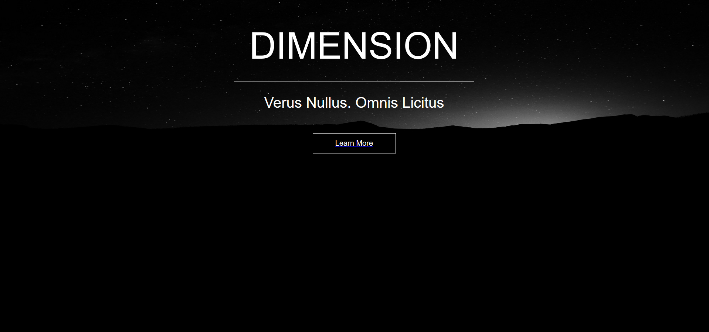
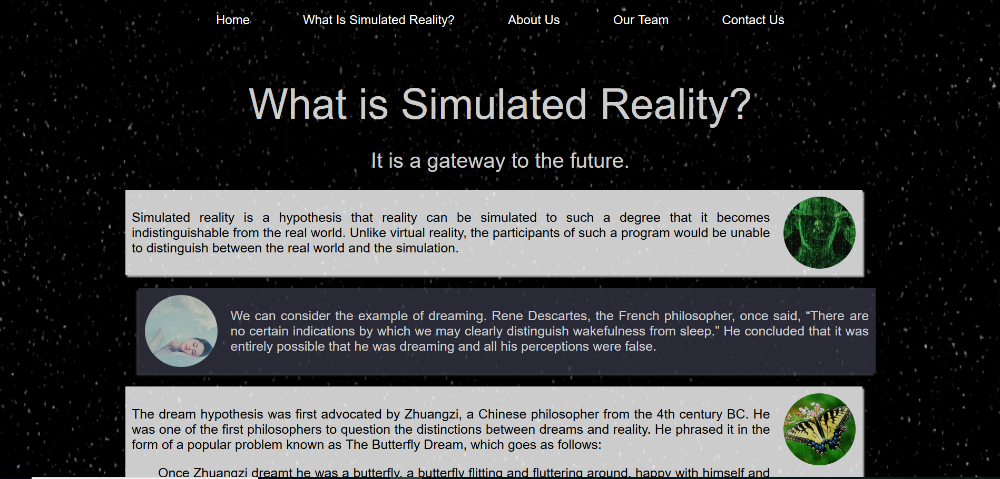

# Simulated Reality Website
Website created for the IT fest Access 2016, held at Modern School, Barakhamba Road in New Delhi, India.
Developers: Udit Malik and Sagnik Anupam, as members of Exun Clan, the CS club of Delhi Public School, R.K. Puram.

Download the repository and click on index.html to get started, or alternatively, visit malikudit.github.io/simulated-reality-website.

All CSS files are stored in the "css" folder. 
The images and fonts used are also inside the CSS folder, in folders named "images" and "font" respectively.

